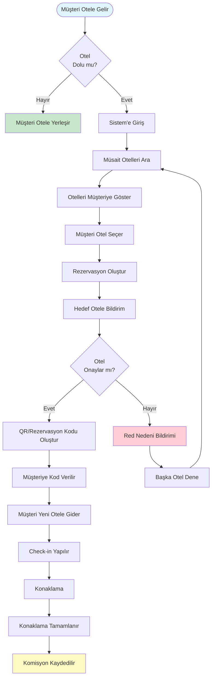
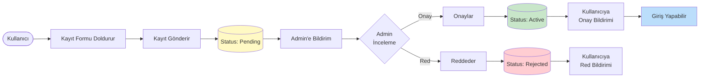
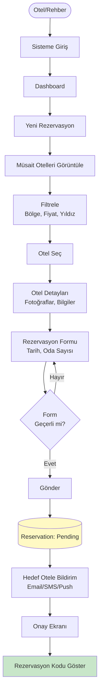
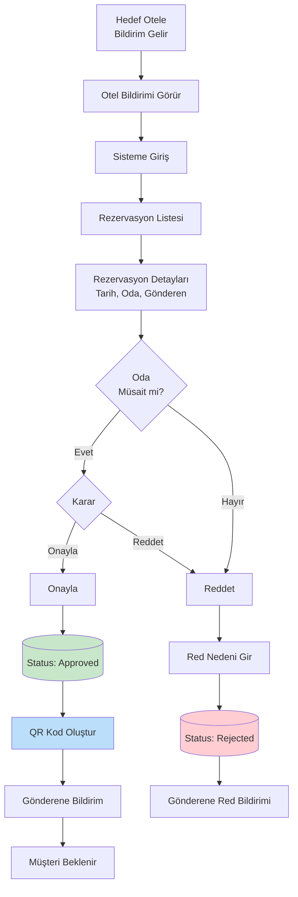
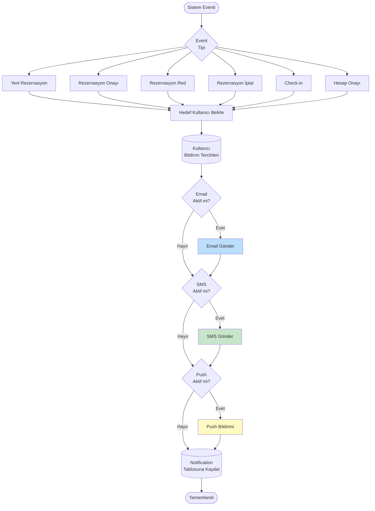
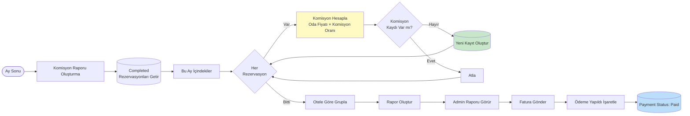
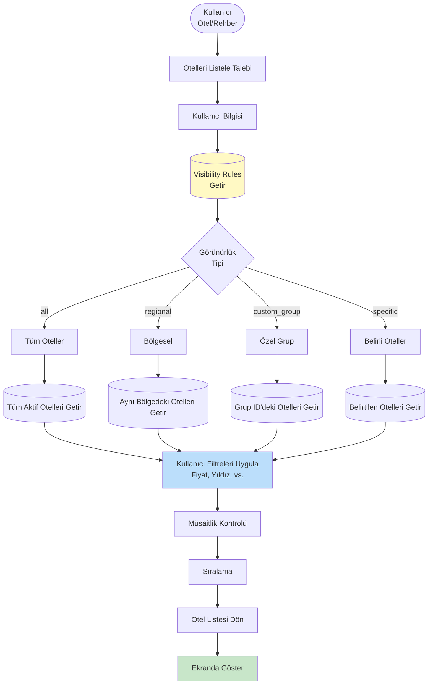
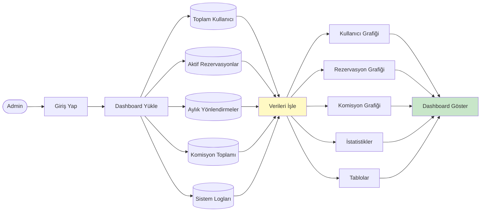

# Akış Diyagramları

Bu doküman OtelPartner sisteminin ana iş akışlarını Mermaid diyagramları ile gösterir.

---

## 🎯 1. Genel Sistem Akışı

---

## 👤 2. Kullanıcı Kayıt ve Onay Akışı

---

## 🔄 3. Rezervasyon Oluşturma Akışı (Detaylı)

---

## ✅ 4. Rezervasyon Onay Akışı

---

## 🏨 5. Check-in ve Tamamlama Akışı

```mermaid
flowchart LR
    Guest([Müşteri Yeni Otele Gelir])
    ShowCode[Rezervasyon Kodu<br/>Gösterir]
    Reception[Resepsiyon Kodu Kontrol Eder]
    
    SystemCheck{Sistem<br/>Kontrol}
    Valid[Geçerli Rezervasyon]
    
    CheckIn[Check-in İşlemi]
    UpdateCheckIn[(Status: Checked-in)]
    RoomAssign[Oda Verilir]
    
    Stay[Konaklama]
    CheckOut[Check-out]
    
    Complete[Konaklama Tamamla Butonuna Bas]
    UpdateComplete[(Status: Completed)]
    
    CreateCommission[(Komisyon Kaydı Oluştur)]
    Report[Aylık Raporda Görünür]
    
    Invalid[Geçersiz Kod]
    Error[Hata Mesajı]
    
    Guest --> ShowCode
    ShowCode --> Reception
    Reception --> SystemCheck
    
    SystemCheck -->|Geçerli| Valid
    Valid --> CheckIn
    CheckIn --> UpdateCheckIn
    UpdateCheckIn --> RoomAssign
    RoomAssign --> Stay
    
    Stay --> CheckOut
    CheckOut --> Complete
    Complete --> UpdateComplete
    UpdateComplete --> CreateCommission
    CreateCommission --> Report
    
    SystemCheck -->|Geçersiz| Invalid
    Invalid --> Error
    
    style UpdateCheckIn fill:#bbdefb
    style UpdateComplete fill:#c8e6c9
    style CreateCommission fill:#fff9c4
    style Invalid fill:#ffcdd2
```

---

## 🔔 6. Bildirim Akışı

---

## 💰 7. Komisyon Hesaplama Akışı

---

## 👁️ 8. Görünürlük Kontrolü Akışı

---

## 📊 9. Admin Dashboard Veri Akışı

---

**Not**: Bu akış diyagramları geliştirme sürecinde güncellenecek ve detaylandırılacaktır.
